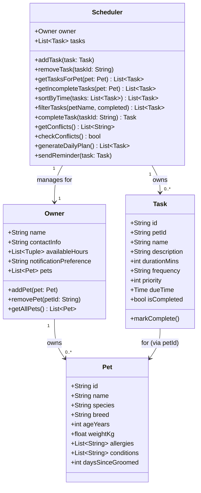

# PawPal+ — Final Class Diagram

```mermaid
classDiagram
    class Owner {
        +String name
        +String contactInfo
        +List~Tuple~ availableHours
        +String notificationPreference
        +List~Pet~ pets
        +addPet(pet: Pet)
        +removePet(petId: String)
        +getAllPets() List~Pet~
    }

    class Pet {
        +String id
        +String name
        +String species
        +String breed
        +int ageYears
        +float weightKg
        +List~String~ allergies
        +List~String~ conditions
        +int daysSinceGroomed
    }

    class Task {
        +String id
        +String petId
        +String name
        +String description
        +int durationMins
        +String frequency
        +int priority
        +Time dueTime
        +bool isCompleted
        +markComplete()
    }

    class Scheduler {
        +Owner owner
        +List~Task~ tasks
        +addTask(task: Task)
        +removeTask(taskId: String)
        +getTasksForPet(pet: Pet) List~Task~
        +getIncompleteTasks(pet: Pet) List~Task~
        +sortByTime(tasks: List~Task~) List~Task~
        +filterTasks(petName, completed) List~Task~
        +completeTask(taskId: String) Task
        +getConflicts() List~String~
        +checkConflicts() bool
        +generateDailyPlan() List~Task~
        +sendReminder(task: Task)
    }

    Owner "1" --> "0..*" Pet : owns
    Scheduler "1" --> "1" Owner : manages for
    Scheduler "1" --> "0..*" Task : owns
    Task --> Pet : for (via petId)
```
