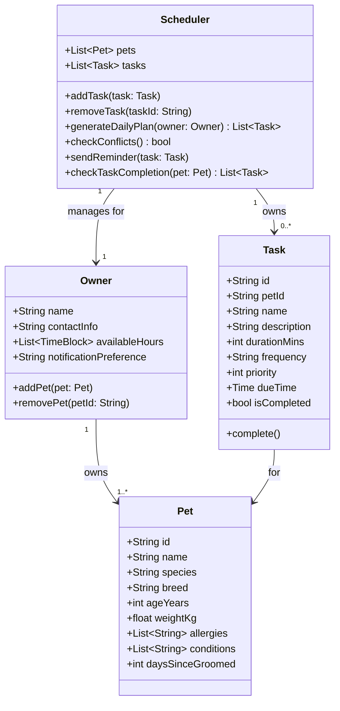

# PawPal+ Class Diagram

```mermaid
classDiagram
    class Owner {
        +String name
        +String contactInfo
        +List~TimeBlock~ availableHours
        +String notificationPreference
        +addPet(pet: Pet)
        +removePet(petId: String)
    }

    class Pet {
        +String id
        +String name
        +String species
        +String breed
        +int ageYears
        +float weightKg
        +List~String~ allergies
        +List~String~ conditions
        +int daysSinceGroomed
    }

    class Task {
        +String id
        +String petId
        +String name
        +String description
        +int durationMins
        +String frequency
        +int priority
        +Time dueTime
        +bool isCompleted
        +complete()
    }

    class Scheduler {
        +List~Pet~ pets
        +List~Task~ tasks
        +addTask(task: Task)
        +removeTask(taskId: String)
        +generateDailyPlan(owner: Owner) List~Task~
        +checkConflicts() bool
        +sendReminder(task: Task)
        +checkTaskCompletion(pet: Pet) List~Task~
    }

    Owner "1" --> "1..*" Pet : owns
    Scheduler "1" --> "1" Owner : manages for
    Scheduler "1" --> "0..*" Task : owns
    Task --> Pet : for
```
